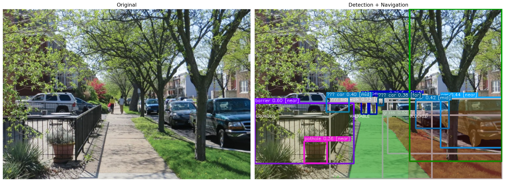

# 🦯 VLM Navigation Pipeline

> Vision-language model pipeline for pedestrian scene understanding and path planning — real-time obstacle detection, surface segmentation, depth estimation, and natural language navigation guidance.

[](https://www.python.org/)
[](#license)
[](https://developer.nvidia.com/cuda-zone)

---

## Overview

The VLM Navigation Pipeline combines three state-of-the-art vision models to help pedestrians — particularly those with accessibility needs — navigate complex real-world environments safely.

| Component | Role |
|-----------|------|
| [GroundingDINO](https://github.com/IDEA-Research/GroundingDINO) | Open-vocabulary object detection |
| [SAM](https://github.com/facebookresearch/segment-anything) | Surface segmentation (sidewalk, road, grass) |
| [MiDaS](https://github.com/isl-org/MiDaS) | Monocular depth estimation |

The system outputs structured navigation decisions (action, risk level, free-space map) and optionally produces concise natural language guidance via a local or cloud LLM.

---

## Features

- **Multi-class detection** — people, vehicles, cyclists, traffic cones, barriers, poles, trees
- **Surface understanding** — sidewalk, road, grass, soil, gravel classification
- **Accessibility hazards** — potholes, cracks, stairs, ramps
- **Free-space analysis** — left / center / right corridor walkability scoring
- **Risk scoring** — distance × severity × crowd density
- **Action selection** — `move_forward`, `move_left`, `move_right`, `slow_down`, `stop`
- **LLM guidance** — single-sentence, action-first natural language output
- **WalkGPT mode** — extended spatial map + accessibility + context output
- **Visualization** — bounding boxes, surface overlays, depth heatmap

---

## Sample Output

### Detection & Navigation Visualization



*Bounding boxes with class labels and distances, surface mask overlays, and free-space corridor highlighting (green = walkable, yellow = crowded, red = blocked).*

### Depth Heatmap


*Depth overlay from MiDaS (blue = near, red = far).*

### Navigation Decision

```
============================================================
  NAVIGATION OUTPUT
============================================================
  ACTION  : MOVE_FORWARD_CAUTIOUS
  RISK    : LOW
  SOURCE  : LLM

  [GUIDANCE]
  Move forward cautiously. Risk: LOW.

  [SPATIAL MAP]
  Left  : crowded    | barrier(near), car(mid)
  Center: walkable   | person(mid), person(mid), car(far)
  Right : blocked    | car(near), car(mid), tree(near)

  [ACCESSIBILITY]
  Surface  : smooth
  Hazards  : pothole (near)
  Width    : adequate (>1.2m)
============================================================
```

---

## Installation

### Requirements

- Python 3.8+
- CUDA-capable GPU (recommended)
- 16 GB RAM (recommended)

### Setup

```bash
# 1. Clone the repository
git clone https://github.com/yourusername/vlm-navigation-pipeline.git
cd vlm-navigation-pipeline

# 2. Create and activate a virtual environment
python -m venv venv
source venv/bin/activate        # Linux / macOS
# venv\Scripts\activate         # Windows

# 3. Install dependencies
pip install -r requirements.txt

# 4. Download model weights
python scripts/download_weights.py
```

### Model Weights

Weights are downloaded automatically by `download_weights.py` into the `weights/` directory.

| Model | File | Source |
|-------|------|--------|
| GroundingDINO | `groundingdino_swint_ogc.pth` | IDEA-Research |
| SAM | `sam_vit_l_0b3195.pth` | Meta AI |
| MiDaS | `dpt_large-midas-2f21e586.pt` | Intel Labs |

---

## Usage

### Basic Detection

```bash
python main.py --image path/to/image.jpg
```

### With Depth Estimation

```bash
python main.py --image path/to/image.jpg --depth
```

### With LLM Guidance (Ollama)

```bash
# Start Ollama and pull a model first
ollama serve
ollama pull phi:2.7b

python main.py --image path/to/image.jpg --llm --llm-provider ollama --llm-model phi:2.7b
```

### WalkGPT Extended Output

```bash
python main.py --image path/to/image.jpg --walkgpt --llm --llm-provider ollama --llm-model phi:2.7b
```

### Full Pipeline

```bash
python main.py \
  --image path/to/image.jpg \
  --depth \
  --llm \
  --walkgpt \
  --output output.png
```

### All Arguments

| Argument | Description | Default |
|----------|-------------|---------|
| `--image` | Input image path | Required |
| `--no-sam` | Disable SAM segmentation | `False` |
| `--depth` | Enable depth estimation | `False` |
| `--llm` | Enable LLM guidance | `False` |
| `--llm-provider` | Backend: `ollama`, `transformers`, `openai`, `gemini`, `grok` | `ollama` |
| `--llm-model` | Model name | `phi:2.7b` |
| `--llm-api-key` | API key for cloud providers | `None` |
| `--walkgpt` | Enable WalkGPT extended output | `False` |
| `--max-size` | Resize input image (px) | `800` |
| `--output` | Output filename | `output.png` |

---

## Project Structure

```
vlm_pipeline/
├── pipeline.py              # Main pipeline class
├── main.py                  # CLI entry point
│
├── config/                  # Configuration
│   ├── thresholds.py        # Per-class detection thresholds
│   ├── prompts.py           # Detection prompt lists
│   └── paths.py             # File path constants
│
├── models/                  # Model loading & inference
│   ├── loader.py            # GroundingDINO + SAM loader
│   └── depth.py             # MiDaS depth estimation
│
├── utils/                   # Utility functions
│   ├── filters.py           # Dedup, Soft-NMS, occlusion filtering
│   ├── geometry.py          # Corridor & geometry helpers
│   ├── distance.py          # Distance estimation
│   └── threshold_utils.py   # Threshold utilities
│
├── navigation/              # Navigation logic
│   ├── free_space.py        # Free-space corridor analysis
│   └── navigation.py        # Action selection & description
│
├── llm/                     # Language model integration
│   ├── client.py            # Multi-provider LLM client
│   ├── prompt.py            # Prompt templates
│   └── fallback.py          # Rule-based fallback
│
├── weights/                 # Model weights (downloaded separately)
├── outputs/                 # Output images
└── scripts/
    └── download_weights.py  # Weight download helper
```

---

## Configuration

### Detection Thresholds (`config/thresholds.py`)

```python
PER_CLASS_THRESHOLDS = {
    "person": 0.40,
    "car":    0.45,
    "sidewalk": 0.30,
    "road":   0.35,
    # ...
}
```

### Detection Prompts (`config/prompts.py`)

```python
MULTI_PROMPTS = [
    "person", "car", "bicycle",
    "traffic cone", "barrier",
    "sidewalk", "road", "grass", "soil",
]
```

### Free-space Parameters (`navigation/free_space.py`)

```python
WALKABLE_COVERAGE    = 0.25   # Minimum surface coverage to be considered walkable
NON_WALKABLE_COVERAGE = 0.30  # Threshold for non-walkable classification
SW_BLOCK_COVERAGE    = 0.50   # Obstacle coverage to mark corridor as blocked
```

---

## Performance Notes

| Configuration | RAM | VRAM | Notes |
|---------------|-----|------|-------|
| Minimum (no SAM) | 8 GB | 4 GB | Use `--no-sam` |
| Recommended (full) | 16 GB+ | 8 GB+ | All features enabled |

**Speed tips:**
- Skip segmentation: `--no-sam`
- Reduce resolution: `--max-size 640`
- Run on GPU for significantly faster inference

---

## Troubleshooting

**Sidewalk not detected**
- Lower the threshold in `PER_CLASS_THRESHOLDS`
- Confirm `"sidewalk"` is listed in `MULTI_PROMPTS`
- Check SAM mask ratio filtering

**Depth estimation fails**
- Verify MiDaS weights exist in `weights/`
- Confirm CUDA is available
- Pass the `--depth` flag explicitly

**LLM not responding**
- Ensure Ollama is running: `ollama serve`
- Pull the model first: `ollama pull phi:2.7b`
- Check your API key for cloud providers

**Visualization is empty**
- Verify detections were produced (check console output)
- Check write permissions on the `outputs/` directory
- Try increasing `--max-size`

---

## License

This project is intended for **research and educational purposes only**.

---

## Acknowledgements

- [GroundingDINO](https://github.com/IDEA-Research/GroundingDINO) — IDEA-Research
- [Segment Anything (SAM)](https://github.com/facebookresearch/segment-anything) — Meta AI Research
- [MiDaS](https://github.com/isl-org/MiDaS) — Intel Labs
- [Ollama](https://ollama.ai/) — Local LLM runtime

---

## Contributing & Issues

Found a bug or have a feature request? Please [open an issue](https://github.com/yourusername/vlm-navigation-pipeline/issues) in the repository.
