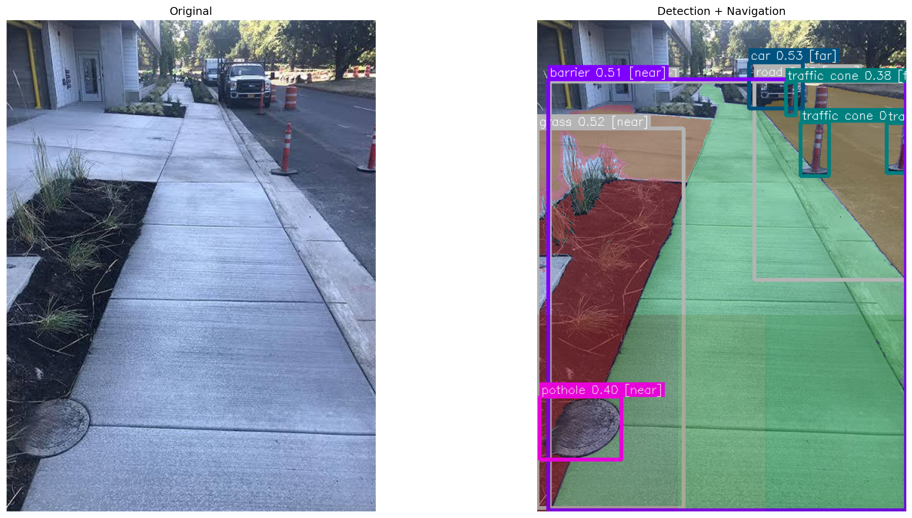
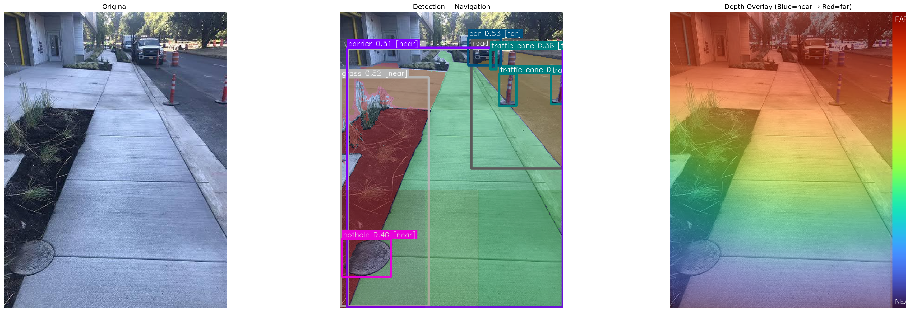

```markdown
# VLM Navigation Pipeline

## Overview

A Vision-Language Model (VLM) based navigation pipeline for pedestrian scene understanding and path planning. The system integrates GroundingDINO for object detection, SAM for segmentation, and MiDaS for depth estimation to produce structured navigation decisions and natural language guidance.

---

## System Architecture

### Core Pipeline

1. Multi-prompt object detection using GroundingDINO
2. Cross-prompt deduplication with semantic priority
3. Soft-NMS and occlusion-aware filtering
4. SAM-based surface segmentation (sidewalk, road, grass)
5. Free-space analysis (left / center / right corridors)
6. Risk scoring (distance + severity + crowd density)
7. Action selection (move forward, turn, stop)
8. Optional LLM-based natural language guidance

---

## Features

### Scene Understanding

- Dynamic objects: person, vehicle, cyclist
- Static obstacles: traffic cone, barrier, pole, tree
- Surface types: sidewalk, road, grass, soil, gravel
- Accessibility hazards: pothole, crack, stairs, ramp

### Navigation Output

- Action: move_forward, move_left, move_right, slow_down, stop
- Risk Level: urgent, high, medium, low, none
- Free-space map: walkable / crowded / blocked / uncertain
- Obstacle summary: type, position, distance, severity

### Optional Language Guidance

- Converts structured output into concise natural language
- Format: action-first, risk-aware, single-sentence
- Falls back to rule-based output if generation fails

### Visualization

- Bounding boxes with class labels and distances
- Surface mask overlays (color-coded by traversability)
- Free-space corridor highlighting
- Depth heatmap overlay (optional)

---

## Sample Outputs

### Detection and Navigation Visualization

The pipeline generates a comprehensive visualization showing detection boxes, surface masks, and free-space corridors.



*Figure 1: Detection visualization with bounding boxes, class labels, distances, and free-space corridor overlay (green=walkable, yellow=crowded, red=blocked).*

### Depth Visualization

When depth estimation is enabled, the pipeline produces a depth heatmap overlay.



*Figure 2: Depth visualization with heatmap overlay (blue=near, red=far).*

### Navigation Output

#### Standard Rule-Based Output

```
============================================================
  NAVIGATION OUTPUT
============================================================
  Action     : move_right
  Risk       : medium
  Free-space : {'left': 'blocked', 'center': 'crowded', 'right': 'walkable'}
  Obstacles  : ['car(far, right)', 'barrier(near, center)']
  Surfaces   : ['sidewalk(near, center)']
  Source     : RULE_BASED

LLM-ready  :
  ACTION: move_right
  RISK: medium
  PATH: center crowded, left blocked, right walkable
  OBSTACLES: car(far, right); barrier(near, center)
  ENV: sidewalk(near, center)
============================================================
```

#### LLM-Enhanced Output

```
============================================================
  NAVIGATION OUTPUT
============================================================
  ACTION: move_right
  RISK  : MEDIUM
  SOURCE: LLM

  [GUIDANCE]
  "Move right.

  [SPATIAL MAP]
  Left  : blocked    | clear
  Center: crowded    | barrier(near)
  Right : walkable   | cone(far), cone(far), car(far), cone(far)

  [ACCESSIBILITY]
  Surface: smooth
  Hazards: pothole (near)
  Width: adequate (>1.2m)
============================================================
```

#### WalkGPT Extended Output

```
============================================================
  NAVIGATION OUTPUT
============================================================
  ACTION: move_forward
  RISK  : LOW
  SOURCE: LLM

  [GUIDANCE]
  "Move forward. The path ahead is clear."

  [SPATIAL MAP]
  Left  : walkable   | sidewalk(near)
  Center: walkable   | sidewalk(near)
  Right : blocked    | cone(mid), tree(far)

  [ACCESSIBILITY]
  Surface: smooth
  Hazards: none
  Width: adequate (>1.2m)

  [CONTEXT]
  Sidewalk detected ahead. Two people visible at mid distance.
  Traffic cones on the right side.
============================================================
```

---

## Project Structure

```
vlm_pipeline/
├── pipeline.py              # Main pipeline class
├── main.py                  # Command-line entry point
│
├── config/                  # Configuration
│   ├── __init__.py
│   ├── thresholds.py        # Detection thresholds
│   ├── prompts.py           # Detection prompts
│   └── paths.py             # File paths
│
├── models/                  # Model loading and inference
│   ├── loader.py            # GDINO + SAM loader
│   └── depth.py             # MiDaS depth estimation
│
├── utils/                   # Utility functions
│   ├── filters.py           # Dedup, NMS, occlusion
│   ├── geometry.py          # Corridor and geometry helpers
│   ├── distance.py          # Distance estimation
│   └── threshold_utils.py   # Threshold utilities
│
├── navigation/              # Navigation logic
│   ├── free_space.py        # Free-space analysis
│   └── navigation.py        # Action selection and description
│
├── llm/                     # Language model integration
│   ├── __init__.py
│   ├── client.py            # Multi-provider LLM client
│   ├── prompt.py            # Prompt templates
│   └── fallback.py          # Rule-based fallback
│
├── weights/                 # Model weights directory
├── outputs/                 # Output images directory
└── scripts/
    └── download_weights.py  # Weight download script
```

---

## Installation

### Requirements

- Python 3.8+
- CUDA-capable GPU (recommended)
- 16GB RAM (recommended)

### Setup

```bash
# Clone repository
git clone https://github.com/yourusername/vlm-navigation-pipeline.git
cd vlm-navigation-pipeline

# Create virtual environment
python -m venv venv
source venv/bin/activate  # Linux/Mac
# or
venv\Scripts\activate     # Windows

# Install dependencies
pip install -r requirements.txt

# Download model weights
python scripts/download_weights.py
```

---

## Usage

### Basic Detection

```bash
python main.py --image path/to/image.jpg
```

### With Depth Estimation

```bash
python main.py --image path/to/image.jpg --depth
```

### With LLM Guidance (Ollama)

```bash
python main.py --image path/to/image.jpg --llm --llm-provider ollama --llm-model phi:2.7b
```

### With WalkGPT Extended Output

```bash
python main.py --image path/to/image.jpg --walkgpt --llm --llm-provider ollama --llm-model phi:2.7b
```

### Full Pipeline

```bash
python main.py \
  --image path/to/image.jpg \
  --depth \
  --llm \
  --walkgpt \
  --output output.png
```

---

## Command Line Arguments

| Argument | Description | Default |
|----------|-------------|---------|
| `--image` | Input image path | Required |
| `--no-sam` | Disable SAM segmentation | False |
| `--depth` | Enable depth estimation | False |
| `--llm` | Enable language model guidance | False |
| `--llm-provider` | LLM backend: ollama, transformers, openai, gemini, grok | ollama |
| `--llm-model` | Model name | phi:2.7b |
| `--llm-api-key` | API key for cloud providers | None |
| `--walkgpt` | Enable extended WalkGPT output format | False |
| `--max-size` | Resize input image | 800 |
| `--output` | Output filename | output.png |

---

## Configuration

### Detection Thresholds

Modify `config/thresholds.py`:

```python
PER_CLASS_THRESHOLDS = {
    "person": 0.40,
    "car": 0.45,
    "sidewalk": 0.30,
    "road": 0.35,
    # ...
}
```

### Detection Prompts

Modify `config/prompts.py`:

```python
MULTI_PROMPTS = [
    "person", "car", "bicycle",
    "traffic cone", "barrier",
    "sidewalk", "road",
    "grass", "soil",
]
```

### Free-space Parameters

Modify `navigation/free_space.py`:

```python
WALKABLE_COVERAGE = 0.25      # Minimum surface coverage
NON_WALKABLE_COVERAGE = 0.30  # Non-walkable threshold
SW_BLOCK_COVERAGE = 0.50      # Obstacle blocking threshold
```

---

## Model Weights

The pipeline requires the following weights in the `weights/` directory:

| Model | File | Source |
|-------|------|--------|
| GroundingDINO | `groundingdino_swint_ogc.pth` | IDEA-Research |
| SAM | `sam_vit_l_0b3195.pth` | Meta AI |
| MiDaS | `dpt_large-midas-2f21e586.pt` | Intel Labs |

Run `scripts/download_weights.py` to download automatically.

---

## Performance Notes

### Speed Optimization

- Disable SAM: `--no-sam`
- Reduce image size: `--max-size 640`
- Use GPU for faster inference

### Memory Usage

- Minimum: 8GB RAM (without SAM)
- Recommended: 16GB+ RAM (full pipeline)
- GPU: 8GB+ VRAM recommended

---

## Troubleshooting

### Sidewalk Not Detected

- Lower threshold in `PER_CLASS_THRESHOLDS`
- Verify "sidewalk" is in `MULTI_PROMPTS`
- Check SAM mask ratio filtering

### Depth Estimation Fails

- Verify MiDaS weights exist
- Ensure CUDA is available
- Use `--depth` flag explicitly

### LLM Issues

- Ensure Ollama is running: `ollama serve`
- Verify model is pulled: `ollama pull phi:2.7b`
- Check API key for cloud providers

### Visualization Empty

- Verify detections exist
- Check output directory permissions
- Increase `--max-size` parameter

---

## License

This project is intended for research and educational purposes.

---

## Acknowledgments

- [GroundingDINO](https://github.com/IDEA-Research/GroundingDINO) - IDEA-Research
- [Segment Anything (SAM)](https://github.com/facebookresearch/segment-anything) - Meta AI Research
- [MiDaS](https://github.com/isl-org/MiDaS) - Intel Labs
- [Ollama](https://ollama.ai/) - Local LLM runtime

---

## Contact

For questions or issues, please open an issue in the repository.